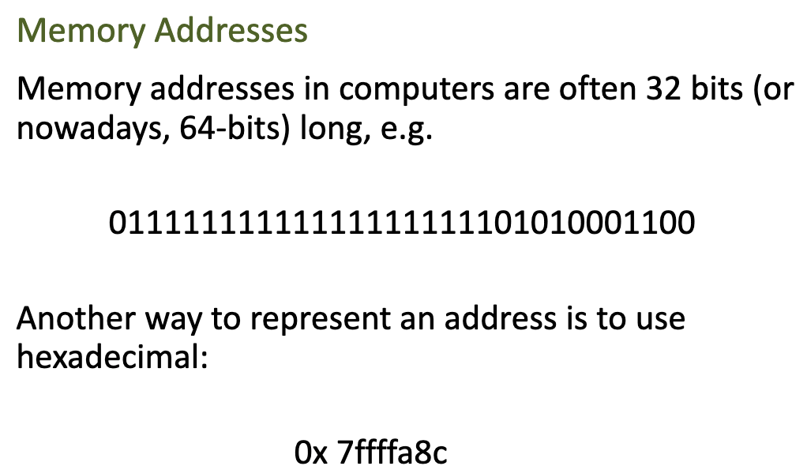
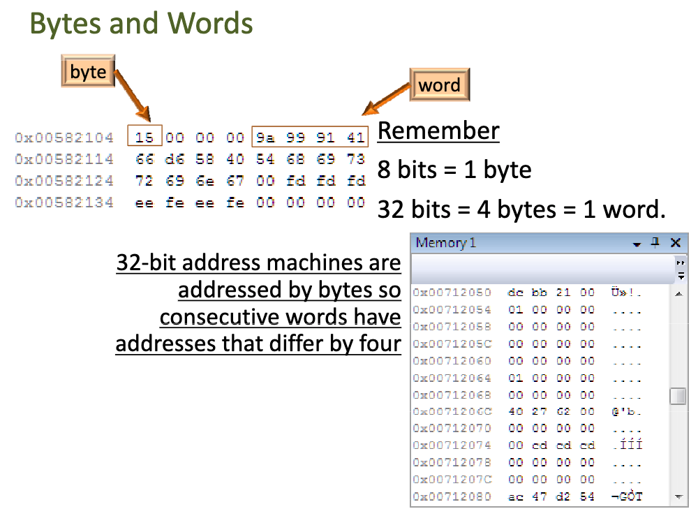
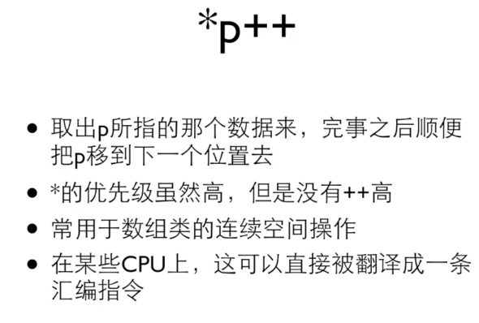
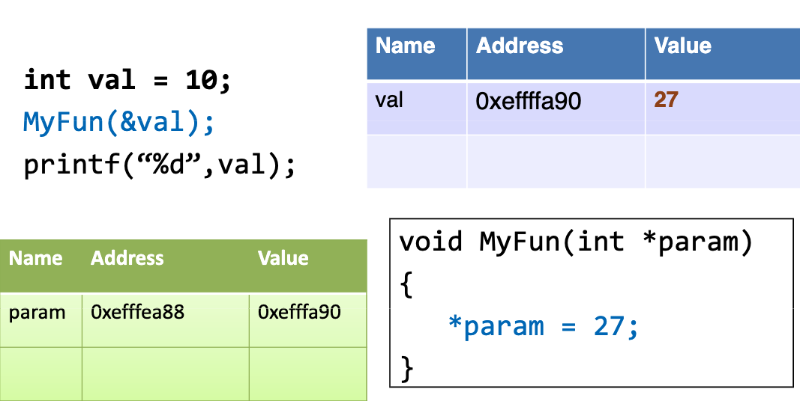
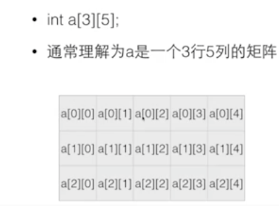
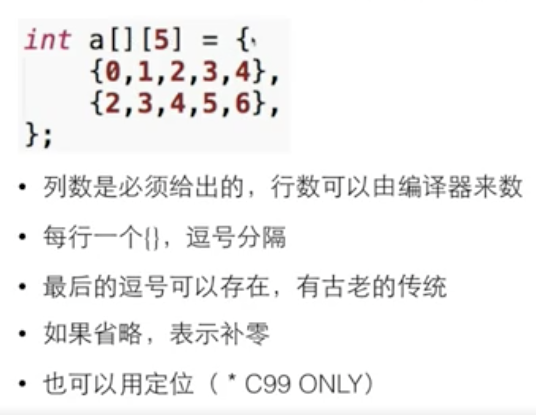
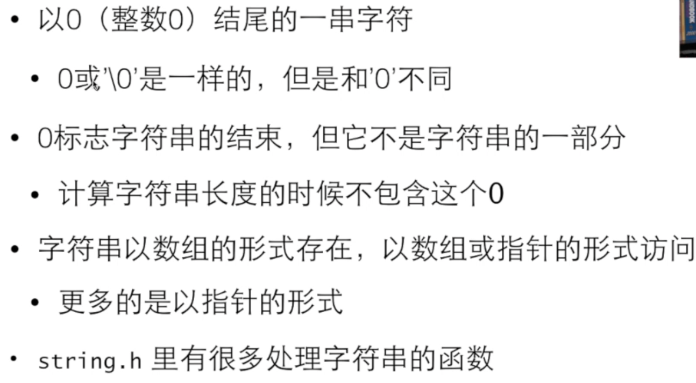
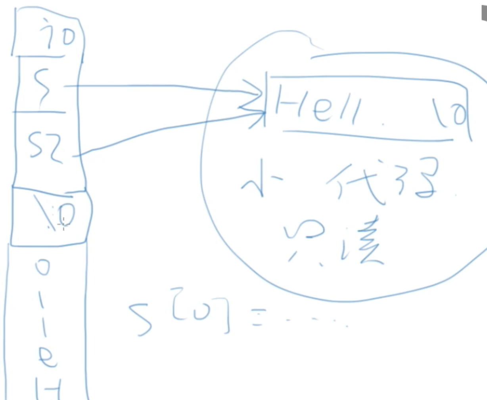

---

typora-copy-images-to: ./images
---

# C语言基础

为了夯实 CS 基本功，于网上找到一份硬核[学习计划](https://www.yuque.com/ob26eq/cv94p5/xi9hwb)，首先学习的是 [C 语言先导课程](https://www.cse.msu.edu/~cse251/index.html)。

**程序**是用特殊的编程语言用来表达如何解决问题的。不是用编程与计算机交谈，而是描述要求其如何做事情的过程和方法。

**程序的执行**

- 解释：借助一个程序，那个程序能理解你的程序，然后按照你的要求执行。
- 编译：借助一个程序，就像一个翻译，把你的程序翻译成计算机真正能懂的语言-机器语言-写的程序，然后这个机器语言写的程序就能执行了

**解释语言 VS 编译语言**

- 语言本无编译/解释之分
- 常用的执行方式而已
- 解释型语言有特殊的计算能力
- 编译型语言有特定的运算性能

## 前置知识（Unix 命令）

```bash
pwd	Displays the current directory
ls	List the current directory	ls
ls -l
ls -a
-l : Include file details, -a : Include hidden files, -F : show directories
touch MyFirstFile setting the time and date of the file to the current time and date, if the file does not exist,it creates an empty one.
rm	Remove a file	rm filetonuke.c rm -i file.c interactive delete file
mkdir	Create a new directory	mkdir cse251
rmdir	Remove a directory	rmdir cse251
Or rm -r if the directory is not empty.
cd	Change current directory	cd ~/cse251
cp	Copy a file	cp souce destination cp ile.c newFile.c  cp ../file.c ~/programs
mv	Move or rename a file	mv hello.c newname.c mv hello.c ../path/
cat	Display the contents of a file	cat hello.c
less	Display file contents nicely	less hello.c
man	Manual pages	man ls
yelp	Nicer help display	yelp &
top	Displays CPU usage	top
q to quit
top display of what processes are using how much CPU and puts the heavies user first
ps	Lists processes	ps u
kill	Kills a process	kill 15577
~: a shortcut for your home directory
gcc hello.c use GNU C Compiler to compile program,and the default output file is a.out
./a.out execute file in the current directory
gcc -o hello hello.c -o indicate the output file is hello instead of a.out
```

## C 语言介绍

在 C 语言头部表明引用的库，如常见的 `<stdio.h>` 表明引入的是标准的输入输出库。

```c
#include <stdio.h>
/*
	上面是必要的格式
	.h 表示头文件，因为这些文件是放在文件的头部
	#include 告诉预处理器将指定的头文件内容插入到预处理器命令的相应位置，导入头文件的预编译指令
	<> 表示系统自带的库
	如果写成 “” 则表明是用户自定义的库，如果没有找到则会去系统自带的库寻找，如果还找不到则报错
*/

/*
 * comment: this is my first program
 */
// main 函数是 C 语言执行的入口 有且只有一个
int main() {
	printf("hello world\n");
  return 0;
}
```


### Escape Characters

- `\n` new line
- `\t` tab
- `\'` print a single quote
- `\\` print a backslash
- many others

### Variable Declarations

- When declare a variable, must tell the compiler what kind of value the variable may hold(its type)
- You cannot change the type of the value a variable can hold once declared
- Everything needs a type in C and it must be declare before use

Syntax: <variable_type> <variable_name> [=<initial_value>]
example: `double width = 10;` `int height;`

变量由字母、数字和下划线组成，且以字母或下划线开头。

```c
#include <stdio.h>
#include <limits.h>

int main() {
  printf("int 储存大小：%lu\n", sizeof(int));
}
```

`printf` 函数输出相关参数，详见[文档](https://www.runoob.com/cprogramming/c-function-printf.html)

```c
#include <stdio.h>
int main() {
  char ch = 'A';
  char str[13] = "www.baidu.com"; 
  float flt = 10.234;
  int no = 143;
  double dbl = 20.123456;
  printf("单个字符串 %c\n", ch);
  printf("字符串 %s\n", str);
  printf("浮点数 %f\n", flt);
  printf("整数 %d\n", no);
  printf("双精度 %lf\n", dbl);
  printf("八进制 %o\n", no);
  return 0;
}
```


```c
#include <stdio.h>
#include <math.h>
int main() {
  printf("%f\n", M_PI); //3.141593
  printf("%.4f\n", M_PI); //3.1416
  printf("%10.2f\n", M_PI); //      3.14
  printf("%-10.2f is PI\n", M_PI); //3.14       is PI
  return 0;
}
```

`%02d`，和`%2d`差不多，只不过左边补0。`%p` 输出变量地址

```c
#include <stdio.h>

int main() {
  float value = 0;
  printf("the value is %p\n", (void*)&value);
  return 0;
}
```

常量定义使用 const 如定义 100，`const int AMOUNT = 100;`，const 表明这个变量值无法修改

`a=b=6;` => `a=(b=6);`

**`%x` 输出的是无符号 16 进制**

## 输入输出练习题


```c
#include<stdio.h>

int main()
{
  int h = 0;
  printf("请输入身高多少厘米，如167：");
  scanf("%d", &h);
  double temp = h / 0.3048 / 100;
  int foot = temp;
  int inch = (temp - foot) * 12;
  printf("%d %d\n", foot, inch);
  return 0;
}
```


```c
#include <stdio.h>

int main() {
  int startTime = 0;
  int mins = 0;
  printf("please enter two integers: \n");
  scanf("%d %d", &startTime, &mins);
  int h = startTime / 100;
  int min = startTime % 100;
  int totalMins = h * 60 + min + mins;
  int endH = totalMins / 60;
  int endMin = totalMins % 60;
  int endTime = endH * 100 + endMin;
  printf("The end time is %d\n", endTime);
  return 0;
}
```


```c
#include <stdio.h>

int main() {
  int input = 0;
  printf("请输入一个正3位数: \n");
  scanf("%d", &input);
  int output = 0;
  while (input > 0)
  {
    int num = input % 10;
    output = output * 10 + num;
    input = input / 10;
  }
  printf("逆为序数为 %d\n", output);
  return 0;
}
```


```c
#include <stdio.h>

int main() {
  int input = 0;
  printf("请输入一个16进制的数字: \n");
  scanf("%d", &input);
  int output = (input / 16) * 10 + input % 16;
  printf("输出的数为 %d\n", output);
  printf("输出的数为 %x\n", input); // 使用16进制输出
  return 0;
}
```

## 流程控制和布尔值

在 C 语言中没有和 JavaScript 类似的 true 和 false 布尔值，这里使用 0 代表 false，非 0 代表 true。我们也可以引入对应的库来使用 true 和 false, 但是本质还是 1 和 0。

```c
#include <stdio.h>
#include <stdbool.h>

int main() {
  const bool TRUE = true;
  bool falseValue = false;
  int int3 = 3;
  int int8 = 8;
  printf("No 'boolean' output type\n");
  printf("bool trueValue: %d\n", TRUE);
  printf("bool falseValue: %d\n", falseValue);
  printf("int int3: %d\n", int3);
  printf("int int8: %d\n", int8);
  return 0;
}

/**
  No 'boolean' output type
  bool trueValue: 1
  bool falseValue: 0
  int int3: 3
  int int8: 8
*/
```

if 语句与其他语言类似。有时候我们需要种植程序如果输入了一个无效的数据，这时候我们可以使用 **exit** 函数，`exit(0)` 表示程序终止成功，`exit(1)` 表示程序退出时出现错误。

```c
#include <stdio.h>
#include <stdlib.h>
int main() {
  int num = 0;
  printf("please enter a number: ");
  scanf("%d", &num);
  if (num < 0) {
    printf("You moron, you entered a negative inductance!\n");
    exit(1);
  }
  else if (num == 0)
  {
    printf("You are really dumb, you entered zero.\n");
  }
  else
  {
    printf("Okay, I guess that's reasonable\n");
    exit(0);
  }
  printf("Output this line when num equals zero\n");
  return 0;
}
```

##  流程控制练习题

Read the instructions carefully before writing your code. Try to figure out what variables, if, and switch statements you need to create. Write a small part at a time and get it working.

i. Create a new file called tax.c. This program will compute the amount of tax owed by a taxpayer based on annual income and amount of tax exemptions.

ii. Prompt the user to enter his/her annual income.

<span style="color: red">If you get a segmentation fault, it is probably because you did not put the & on the variable in your scanf statement: scanf("%lf", &annualIncome);</span>

iii. If the annual income is less than $9350, the amount of tax owed is zero. Output zero and exit the program. You should get this part working before proceeding.

<span style="color: blue">Incremental Development means you write as little code at a time as you can and test it and get it working. Often it is useful to add in printf statements just to ensure a value is what you are expecting, then remove the statement when you are done.</span>

If you see this error:

```
tax.c:13: warning: incompatible implicit declaration of built-in function 'exit'
```

You forgot to #include <stdlib.h>

iv. Prompt the user to specify filing status, either as: (1) single, (2) married, filing jointly, or (3) married, filing separately

If the user chooses option (1) or option (3), set the number of dependents at 1 and the standard deduction to 5700.
If the user chooses option (2), set the standard deduction to 11400 and prompt the user to enter the number of children. In this case, set the number of dependents to 2 + number of children. Hint: Use switch-case to implement the selection options.

v. Multiply the number of dependents by 3650 and add the standard deduction to determine the total deductions.

vi. Compute the taxable income as the annual income minus the deductions computed in (v) using the following table:

<p style="display:flex;justify-content: center;font-weight: 700;">2010 Federal Income Tax Table If taxable income is:</p>

| Over     | But Not Over | The Tax Is       | Of The Amount Over |
| -------- | ------------ | ---------------- | ------------------ |
| $0       | $16,750      | $0 + 10%         | $0                 |
| $16,750  | $68,000      | $1,675 + 15%     | $16,750            |
| $68,000  | $137,300     | $9,362.50 + 25%  | $68,000            |
| $137,300 | **And Over** | $26,687.50 + 28% | $137,300           |

vii. Display the amount of taxes owed on the screen.

This is a reduced tax table to shorten the project and in the real world there is a different tax table for each filing status. But, you get the idea, right?

As an example, suppose we have married with 3 children making $75000 per year. The annual income is 75000. The number of dependents is 2 + 3 = 5. The standard deduction is 11400. Hence, the total deductions are 11400 + 5 * 3650 = 29650. The taxable income is 75000-29650 = 45350. In the table we see that this amount is over 16750, but not over 68000, so the tax is 1675 + 15% * (45350 - 16750) = 5965. The program should output 5965.

Some other example outputs:


```c
#include <stdio.h>
#include <stdlib.h>
int main() {
  int income = 0;
  int filingStatus = 0;
  int children = 0;
  float tax = 0;
  int deduction = 0;
  int dependents = 0;
  printf("Enter your annual income:");
  scanf("%d", &income);
  if (income < 9350) {
    printf("%.0f\n", tax);
    exit(0);
  }
  printf("What is your filing status?\n");
  printf("1) single\n");
  printf("2) married filing jointly\n");
  printf("3) married filing separately\n");
  printf("please enter a number:");
  scanf("%d", &filingStatus);
  switch (filingStatus)
  {
  case 1:
    deduction = 5700;
    dependents = 1;
    break;
  case 2:
    deduction = 11400;
    dependents = 2;
    break;
  case 3:
    deduction = 5700;
    dependents = 1;
    break;
  default:
    printf("Please enter the correct number, 1、2 or 3.");
    exit(1);
    break;
  }
  if (filingStatus == 2) {
    printf("How much children do you have?");
    scanf("%d", &children);
    if (children < 0) {
      printf("Please enter the correct number of children");
      exit(1);
    }
    dependents += children;
  }
  int totalDeductions = deduction + dependents * 3650;
  int taxableIncome = income - totalDeductions;
  if (taxableIncome <= 16750)
  {
    tax = 0.1 * taxableIncome;
  }
  else if (taxableIncome <= 68000)
  {
    tax = 1675 + (taxableIncome - 16750) * 0.15;
  }
  else if (taxableIncome <= 137300)
  {
    tax = 9362.50 + (taxableIncome - 68000) * 0.25;
  }
  else
  {
    tax = 26687.50 + (taxableIncome - 137300) * 0.28;
  }
  printf("%.2f\n", tax);
  return 0;
}
```

## 循环相关习题

循环 for、while、do while 其语法与 JavaScript 类似。跳出多层最里面的循环，可以使用 goto 但是不推荐使用，这破坏了程序的基础结构。

### 输出 sin 函数曲线：

```c
#include <stdio.h>
#include <math.h>

int main() {
  double angle;
  int numSteps = 20;
  double maxAngle = M_PI * 2;
  int i = 0;
  double sinValue;
  int numSpaces;
  for (i = 0; i <= numSteps; i++)
  {
    angle = (double)i / numSteps * maxAngle;
    sinValue = sin(angle);
    numSpaces = ceil(30 + sinValue * 30);
    printf("%3d: %5.2f %*c\n", i, angle, numSpaces, '*');
  }

  return 0;
}
```


修改上面代码使其具有以下功能：

a) 获取用户输入 step 数，如果输入的数值小于 2，则再次获取用户输入数值，通过 do/while 实现该循环。

b) 通过用户输入的数值来绘画 sin 函数曲线

c) 不在使用 * 进行绘制，如果波形下降使用 /，如果波形上升使用 \，如果绝对值小于 0.1 则使用 *，输出的波形如下所示


```c
#include <stdio.h>
#include <math.h>
#include <stdbool.h>


int main() {
  int numSteps = 0;
  do
  {
    printf("Input the number of steps: ");
    scanf("%d", &numSteps);
  } while (numSteps < 2);
  double angle;
  double maxAngle = M_PI * 2;
  int i = 0;
  double sinValue;
  int numSpaces;
  bool isRising = true;
  char wave = '*';
  for (i = 0; i <= numSteps; i++)
  {
    angle = (double)i / numSteps * maxAngle;
    sinValue = sin(angle);
    if (isRising) {
      wave = '\\';
    } else {
      wave = '/';
    }
    if ((int)fabs(sinValue) == 1) {
      wave = '*';
      isRising = !isRising;
    }
    numSpaces = ceil(30 + sinValue * 30);
    printf("%3d: %5.2f %*c\n", i, angle, numSpaces, wave);
  }

  return 0;
}
```

### 求最大公约数

```c
/**
 * 辗转相除法
 * 如果 b = 0, 则计算结束，a 就是最大公约数
 * 否则计算 a 除以 b 的余数，让 a 等于 b，b 等于那个余数
 * 回到第一步
 * a    b    t
 * 12   18   12
 * 18   12   6
 * 12   6    0
 * 6    0
*/
#include <stdio.h>
#include <math.h>

int main()
{
  int a;
  int b;
  int t;
  scanf("%d %d", &a, &b);
  while (b != 0)
  {
    t = a % b;
    a = b;
    b = t;
  }
  printf("gcd=%d\n", a);
}
```

## 斐波那契数列

```c
#include <stdio.h>

int main() {
  int fib1 = 0;
  int fib2 = 1;
  int i = 0;
  int temp = 0;
  for (i = 0; i < 12; i++)
  {
    printf("F(%d) = %d\n", i, fib1);
    temp = fib1;
    fib1 = fib2;
    fib2 = temp + fib1;
  }
    return 0;
}
/**
  F(0) = 0
  F(1) = 1
  F(2) = 1
  F(3) = 2
  F(4) = 3
  F(5) = 5
  F(6) = 8
  F(7) = 13
  F(8) = 21
  F(9) = 34
  F(10) = 55
  F(11) = 89
*/
```

## 函数

```c
return_type function_name(parameter_list)
{
   ...
   function body
   ...
}
```

如果一个函数没有返回值，则返回类型为 `void`

 


可以通过 `man func_name` 来查看函数库中的函数如何使用

### 程序参数

`int main(int argc, char const *argv[])`

```c
#include <stdio.h>
#include <stdlib.h>

int main(int argc, char const *argv[]) {
  int i = 0;
  for (i = 0; i < argc;i++) {
    printf("%d:%s\n", i, argv[i]);
  }
  return 0;
}
/**
 *./hello2 1 2 3
  0:./hello2
  1:1
  2:2
*/
```

### 随机数

**`void srand(unsigned seed);`**

计算机并不能产生真正的随机数，而是已经编写好的一些无规则排列的数字存储在电脑里，把这些数字划分为若干相等的N份，并为每份加上一个编号用srand()函数获取这个编号，然后rand()就按顺序获取这些数字，当srand()的参数值固定的时候，rand()获得的数也是固定的，所以一般srand的参数用time(NULL)，因为系统的时间一直在变，所以rand()获得的数，也就一直在变，相当于是随机数了。因此只需在主程序开始处调用 `srand((unsigned)time(NULL))`; 

如果上述生成随机数报如下错误 call to undeclared function 'time'; ISO C99 and later do not support implicit function declarations。那么我们需要声明调用 time 的函数来源，此时我们需要这样使用才能正常产生随机数。`#include <time.h>`

### [Step 6作业](https://www.cse.msu.edu/~cse251/step6.html)

```c
#include <stdio.h>
#include <stdlib.h>
#include <time.h>
#include <math.h>

// Function declaration
void PrintCard(int card, int suit);
void PrintResult(int card1, int suit1, int card2, int suit2);
void PrintPlayerInfo(int card, int suit, char player[]);

/*
 * Name : <Peter Liu>
 * Program to draw playing cards
 */

int main()
{
  int suit1 = 0;
  int card1 = 0;
  int suit2 = 0;
  int card2 = 0;

  /*
   . This seeds the random number
   . generator with the current time
   */
  srand(time(NULL));
  while (suit1 == suit2 && card1 == card2)
  {
    /* Create a random card and suit */
    /* This will compute a random number from 0 to 3 */
    suit1 = rand() % 4;
    suit2 = rand() % 4;

    /* This will compute a random number from 1 to 13 */
    card1 = rand() % 13 + 1;
    card2 = rand() % 13 + 1;
  }
  
  PrintPlayerInfo(card1, suit1, "The player 1");
  PrintPlayerInfo(card2, suit2, "The player 2");
  PrintResult(card1, suit1, card2, suit2);
  printf("\n");
}

void PrintResult(int card1, int suit1, int card2, int suit2)
{
  if (card1 == 1)
  {
    card1 += 13;
  }
  if (card2 == 1)
  {
    card2 += 13;
  }
  if (card1 > card2)
  {
    printf("Player 1 wins");
  }
  else if (card1 < card2)
  {
    printf("Player 2 wins");
  }
  else
  {
    if (suit1 < suit2)
    {
      printf("Player 1 wins");
    }
    else if (suit1 > suit2)
    {
      printf("Player 2 wins");
    }
    else
    {
      printf("There is a tie");
    }
  }
}

void PrintPlayerInfo(int card, int suit, char player[])
{
  printf("%s:", player);
  PrintCard(card, suit);
  printf("\n");
}

void PrintCard(int card, int suit)
{
  switch (card)
  {
  case 1:
    printf("Ace");
    break;

  case 11:
    printf("Jack");
    break;

  case 12:
    printf("Queen");
    break;

  case 13:
    printf("King");
    break;

  default:
    printf("%d", card);
    break;
  }

  printf(" of ");

  switch (suit)
  {
  case 0:
    printf("Hearts");
    break;

  case 1:
    printf("Diamonds");
    break;

  case 2:
    printf("Spades");
    break;

  case 3:
    printf("Clubs");
    break;
  }
}
```

## 指针和引用参数

**指针**是用来存储内存地址的变量


内存就是一长串一个接一个的数字。每个数字是8位(BYTE)。内存地址通常为 32 位或 64 位。我们通常用二进制或者 16 进制来表示。在 C 语言中 0x 开头表示 16 进制。






### 指针

指针是包含地址的变量，如 `type *var_name;` 方式进行声明，**type** 是指针的基类型，它必须是一个有效的 C 数据类型

```c
#include <stdio.h>

int main()
{
  int var = 20; /* 实际变量的声明 */
  int *ip;      /* 指针变量的声明 */

  ip = &var; /* 在指针变量中存储 var 的地址 */

  printf("var 变量的地址: %p\n", &var);

  /* 在指针变量中存储的地址 */
  printf("ip 变量存储的地址: %p\n", ip);

  /* 使用指针访问值 */
  printf("*ip 变量的值: %d\n", *ip);

  int *ptr = NULL; /* 定义一个空指针 0x0 */
  printf("ptr 的地址是 %p\n", ptr);
  if (!ptr)
  {
    printf("ptr 是一个空指针");
  }
  return 0;
}
/*
  var 变量的地址: 0x7ff7bdd232d8
  ip 变量存储的地址: 0x7ff7bdd232d8
  *ip 变量的值: 20
  ptr 的地址是 0x0
*/
```

`printf("%x\n", (int)&a);`我们可以通过上述方法输出变量的内存地址。但是你也可能会看到以下警告信息：

<span style="color:red">warning: cast from pointer to integer of different size</span> 这是由于当前电脑为 64 位电脑，上述代码将 64 位内存地址转换为 32 位整数。因此在 64 位电脑，需要修改成以下代码 `printf("%lx\n", (long int)&a);`

**指针加1实际加的是 sizeof(type) 的大小, 指针减1也是类似,指针可以做比较，实际比较地址的值；不同类型的指针不能相互赋值**

```c
#include <stdio.h>

int main() {
  char ac[] = {0, 1, 2, 3, 4,5,6,7,8,9};
  char *p = ac; // <=> *p = &ac[0]
  char *p1 = &ac[5];
  printf("p  =%p\n", p);     // p  =0x7ff7b2b5d257
  printf("p+1=%p\n", p + 1); // p+1=0x7ff7b2b5d258
  printf("*(p+1)=%d\n", *(p + 1)); // *(p+1)=1  *(p + n) <=> &ac[n]
  printf("p1-p=%d\n", p1 - p);     // p1-p=5
  int ai[] = {0, 1, 2, 3, 4, 5, 6, 7, 8, 9};
  int *q = ai;
  int *q1 = &ai[6];
  printf("q  =%p\n", q);     // q  =0x7ff7b2b5d260
  printf("q+1=%p\n", q + 1); // q+1=0x7ff7b2b5d264
  printf("*(q+1)=%d\n", *(q + 1)); //*(q+1)=1 <=> ai[1]
  printf("q1-q=%d\n", q1 - q);     // q1-q=6
  return 0;
}
```




### 引用参数

指针的一个作用就是：向函数传递参数的地址





### 指针应用

- 交换变量 swap 函数

- 指针函数用于返回多个值，如同一个函数中找到数组中最小及最大值

- 用于函数返回状态

  ```c
  #include <stdio.h>
  
  /*
   * 如果除法成功，返回1，否则返回0
  */
  int divide(int a, int b, int *res);
  
  int main()
  {
    int a = 5;
    int b = 2;
    int c;
    if (divide(a, b, &c)) {
      printf("%d/%d=%d", a, b, c);
    }
    return 0;
  }
  
  int divide(int a, int b, int *res)
  {
    int ret = 1;
    if (b == 0) {
      ret = 1;
    } else {
      *res = a / b;
    }
    return ret;
  }
  ```

### 指针与 const

```c
int i;
const int *p1 = &i;
int const *p1 = &i;
int *cont p1 = &i;
```

判断哪个被 const 了的标志是 const 在 * 前面还是后面，因此前两个作用是一样的，指针指向的变量不能修改，最后一个是指针不能修改。


```c
/*
 * 传递的数组参数在函数中不会被改变
*/
int test(const int arr[]);

int main()
{
  const int a[] = {1, 2, 3, 4, 5}; // 确保数组声明后无法改变
  return 0;
}
```

### Step7 作业

```c
#include <stdio.h>
#include <stdlib.h>
#include <math.h>

void InputQuadraticEquation(double *a, double *b, double *c);
void QuadraticEquation(double a, double b, double c, double *pZ1r, double *pZ1i, double *pZ2r, double *pZ2i);

/*
 * Name : <Insert name here>
 * Program to compute the zeros of a
 * quadratic equation
 */

int main()
{
  /* Values for the quadratic formula */
  double a, b, c;
  double z1r, z1i; /* First zero */
  double z2r, z2i; /* Second zero */

  InputQuadraticEquation(&a, &b, &c);
  QuadraticEquation(a, b, c, &z1r, &z1i, &z2r, &z2i);
  /* Display the results */
  printf("Zero 1: %f + %fj\n", z1r, z1i);
  printf("Zero 2: %f + %fj\n", z2r, z2i);
}
/*
 * Input a quadratic equation as a, b, and c
 */
void InputQuadraticEquation(double *a, double *b, double *c)
{
  printf("Input a: ");
  scanf("%lf", a);
  printf("Input b: ");
  scanf("%lf", b);
  printf("Input c: ");
  scanf("%lf", c);
}
/*
 * This code computes the quadratic equation
 * for both real and complex zeros
 */
void QuadraticEquation(double a, double b, double c, double *pZ1r, double *pZ1i, double *pZ2r, double *pZ2i)
{
  /* Compute the discriminant */
  double discriminant = b * b - 4 * a * c;
  if (discriminant >= 0)
  {
    /* If the discriminant is greater than or
       equal to zero, the zeros are real */
    *pZ1r = (-b + sqrt(discriminant)) / (2 * a);
    *pZ2r = (-b - sqrt(discriminant)) / (2 * a);
    *pZ1i = 0;
    *pZ2i = 0;
  }
  else
  {
    /* If the discriminant is less than zero
       the zeros are complex  */
    *pZ1r = -b / (2 * a);
    *pZ2r = *pZ1r;
    *pZ1i = sqrt(-discriminant) / (2 * a);
    *pZ2i = -sqrt(-discriminant) / (2 * a);
  }
}
```

## 数组


数组作为函数的参数传递时是引用传递 `passed by reference`

`void SortArray( double array[], int size)`。

数组初始化赋值。






### 数组的大小

- `sizeof` 给出整个数组所占内容的大小，单位是字节， `sizeof(a)/sizeof(a[0])`
- `sizeof(a[0])` 得到数组中国单个元素的大小，因此相除可以得到数组的个数
- 数组作为参数时，必须传递另外一个参数来表示数组的代销，不能使用 `sizeof` 来计算数组的元素个数

```c
#include <stdio.h>

int main() {
  int arr[] = {0,1,2,3,4,5,6,7};
  int *p = &arr[5];
  printf("%d\n", *p); // 5
  printf("%d\n", p[0]); // 5
  printf("%d\n", p[2]); // 7
  printf("%d\n", p[3]); // 越界，随机数
  printf("%d", p[-2]); // 3

}
```

### 数组例子：素数

可以通过是否能被已知的且 `<x` 的素数整除来判断

```c
#include <stdio.h>

int isPrime(int i, int prime[], int primeCount);
int main()
{
  const int CAPACITY = 100;
  int prime[CAPACITY] = {2};
  int i = 3;
  int count = 1;
  while (count < CAPACITY) {
    if (isPrime(i, prime, count)) {
      prime[count++] = i;
    }
    i++;
  }
  for (int j = 0; j < count; j++) {
    printf("%d", prime[j]);
    if ((j + 1) % 5)
      printf("\t");
    else
      printf("\n");
  }
  return 0;
}

int isPrime(int i, int prime[], int primeCount)
{
  int ret = 1;
  for (int j = 0; j < primeCount; j++) {
    if (i % prime[j] == 0) {
      ret = 0;
      break;
    }
  }
  return ret;
}
```

### 搜索例子

获取相应的英文名称。

```c
#include <stdio.h>

int Search(int key, int a[], int len);
int main()
{
  int amount[] = {1, 5, 10, 25, 50};
  char *name[] = {"penny", "nickel", "dime", "quarter", "half-dollar"};
  int k = 10;
  int r = Search(k, amount, sizeof(amount) / sizeof(amount[0]));
  if (r > -1) {
    printf("%s\n", name[r]);
  }
}

int Search(int key, int a[], int len)
{
  int ret = -1;
  for (int i = 0; i < len; i++)
  {
    if (a[i] == key)
    {
      ret = i;
      break;
    }
  }
  return ret;
}
```

也可以定义一下数组来实现上述功能

```c
#include <stdio.h>

int main()
{
  struct
  {
    int amount;
    char *name;
  } coins[] = {
      {1, "penny"},
      {5, "nickel"},
      {10, "dime"},
      {25, "quarter"},
      {50, "half-dollar"}};

  int k = 10;
  // int r = Search(k, amount, sizeof(amount) / sizeof(amount[0]));
  for (int i = 0; i < sizeof(coins) / sizeof(coins[0]); i++)
    if (k == coins[i].amount)
    {
      printf("%s\n", coins[i].name);
      break;
    }
}
```

Step 8 作业

```c
#include <stdio.h>

/*
 * Program to experiment with character arrays
 * test case: The comfort of a knowledge of a rise above the sky   but could never parallel the challenge of an   acquisition   in the   here and now.
 */

#define MaxWord 20

int main()
{
  char c;
  char str[MaxWord + 1];
  int len = 0;
  int maxLen = 0;
  int sumLen = 0;
  int strCount = 0;
  puts("Enter text. Include a dot ('.') to end a sentence to exit:");
  do
  {
    c = getchar();
    if (c != ' ' && c != '.')
    {
      /* This is a character of a word */
      if (len < MaxWord) {
        str[len] = c;
        len++;
      }
       
    }
    else
    {
      if (len == 0) {
        continue;
      }
      /* The word is done */
      str[len] = 0;
      printf("%s\n", str);
      strCount++;
      sumLen += len;
      if (len > maxLen)
      {
        maxLen = len;
      }
      len = 0;
    }
  } while (c != '.');
  printf("The average word length is %.2lf\n", (double)sumLen / strCount);
  printf("The longest word length is %d\n", maxLen);
}
```

### 多项式加法

**题目内容：**

一个多项式可以表达为x的各次幂与系数乘积的和，比如：

2x6+3x5+12x3+6x+20

现在，你的程序要读入两个多项式，然后输出这两个多项式的和，也就是把对应的幂上的系数相加然后输出。

程序要处理的幂最大为100。

**输入格式:**

总共要输入两个多项式，每个多项式的输入格式如下：

每行输入两个数字，第一个表示幂次，第二个表示该幂次的系数，所有的系数都是整数。第一行一定是最高幂，最后一行一定是0次幂。

注意第一行和最后一行之间不一定按照幂次降低顺序排列；如果某个幂次的系数为0，就不出现在输入数据中了；0次幂的系数为0时还是会出现在输入数据中。

**输出格式：**

从最高幂开始依次降到0幂，如：

2x6+3x5+12x3-6x+20

注意其中的x是小写字母x，而且所有的符号之间都没有空格，如果某个幂的系数为0则不需要有那项。

**输入样例：**

6 2

5 3

3 12

1 6

0 20

6 2

5 3

2 12

1 6

0 20

**输出样例：**

4x6+6x5+12x3+12x2+12x+40

```c
#include <stdio.h>

#define MaxMin 101
void ScanfMinValue(int arr[]);
int main()
{
  // 数组 索引是幂次 值对应的是系数，因为系数为 0 不用输出，所以默认初始值为0
  int arr[MaxMin] = {0};
  ScanfMinValue(arr);
  ScanfMinValue(arr);
  // 用于判断是否已经输出，如果已经输出则需要输出 +
  int hasPrint = 0;
  // 幂次从高到低输出
  for (int i = MaxMin - 1; i >= 0; i--)
  {
    if (arr[i] == 0 && i != 0)
    {
      // 说明不存在该幂次
      continue;
    }
    if (hasPrint)
    {
      // 系数为正
      if (arr[i] > 0)
      {
        printf("+");
      }
    }
    if (i == 0)
    {
      // 幂次为0 直接输出
      printf("%d", arr[i]);
    }
    else if (i == 1 && arr[i] == 1)
    {
      // 如果幂次和系数都为1
      printf("x");
    }
    else if (i == 1)
    {
      // 如果幂次为 1
      printf("%dx", arr[i]);
    }
    else if (arr[i] == 1)
    {
      // 如果系数为 1
      printf("x%d", i);
    }
    else
    {
      printf("%dx%d", arr[i], i);
    }
    hasPrint = 1;
  }
  printf("\n");
  return 0;
}

void ScanfMinValue(int arr[])
{
  int x = -1;
  int y;
  int i = 0;
  while (x != 0)
  {
    scanf("%d %d", &x, &y);
    arr[x] += y;
  }
}
```

### 鞍点

**题目内容：**

 给定一个n*n矩阵A。矩阵A的鞍点是一个位置（i，j），在该位置上的元素是第i行上的最大数，第j列上的最小数。一个矩阵A也可能没有鞍点。 你的任务是找出A的鞍点。 输入格式: 输入的第1行是一个正整数n, （1<=n<=100），然后有n行，每一行有n个整数，同一行上两个整数之间有一个或多个空格。 

**输出格式：** 

对输入的矩阵，如果找到鞍点，就输出其下标。下标为两个数字，第一个数字是行号，第二个数字是列号，均从0开始计数。 如果找不到，就输出 NO 题目所给的数据保证了不会出现多个鞍点。

 **输入样例：**

 4 

1 7 4 1

 4 8 3 6

 1 6 1 2

 0 7 8 9

 **输出样例：**

 2 1

```c
#include <stdio.h>
int main()
{
  int n;
  scanf("%d", &n);
  int arr[n][n + 1];
  int i = 0;
  int j = 0;
  // 用于保存每列的最小值
  int minCol[n];
  for (int m = 0; m < n; m++)
  {
    minCol[m] = 32767;
  }
  while (i < n)
  {
    int a = -32768;
    for (j = 0; j < n; j++)
    {
      scanf("%d", &arr[i][j]);
      // 获取每行数据的同时，计算出该行的最大数
      if (arr[i][j] > a)
      {
        a = arr[i][j];
      }
      // 计算当前每列最小值
      if (arr[i][j] < minCol[j])
      {
        minCol[j] = arr[i][j];
      }
    }
    arr[i][n] = a;
    i++;
  }
  int found = 0;
  for (i = 0; i < n; i++)
  {
    for (j = 0; j < n;j++) {
      if (arr[i][j] == arr[i][n] && arr[i][j] == minCol[j]) {
        found = 1;
        printf("%d %d\n", i, j);
        break;
      }
    }
  }
  if (found == 0) {
    printf("NO\n");
  }
  return 0;
}
```

## 字符串和文件 I/O

### 字符类型

char 是一种整数，也是一种特殊类型：字符，这是因为：

- 用单引号表示的字符字面量： 'a'，'1'
- ''也是一个字符
- printf 和 scanf 用 %c 来输入输出字符

```c
#include <stdio.h>

int main() {
  char c;
  char d;
  c = 1;
  d = '1';
  printf("c = %d\n", c); // c = 1
  printf("d = %d\n", d); // d = 49
  printf("d = '%c'", d); // d = '1'
  return 0;
}

#include <stdio.h>
#include <ctype.h>

int main()
{
  char c = 'c';
  char d = 'D';
  char e = 'E';
  printf("the upper case of c:%c\n", toupper(c));
  printf("the lower case of D:%c\n", tolower(d));
  printf("the upper case of E:%c\n", toupper(e));
}
```

如何输入 '1' 字符给 char c?

- `scanf("%c", &c);`   —> 1
- `scanf("%d", &i); c=i;`  —> 49
- '1' 的 ASCII 表码是 49，所以当 c == 49 时，它代表 '1'，即 49 == '1'

```c
#include <stdio.h>

int main() {
  char c = 'c';
  char d = 'D';
  printf("%c\n", c - 'a' + 'A'); // C
  printf("%c\n", d - 'A' + 'a'); // d
}
```


### 字符串

字符串是数组，声明方式如下：

```c
#include <stdio.h>

int main() {
  char *str = "hello";
  char word[] = "hello";
  char line[10] = "hello";
}
```



字符串常量 "hello"

- "hello" 会被编译器变成一个字符串数组放在某处，这个数组的长度是6，结尾还有表示结束的 0
- 两个相邻的字符串常量会被自动连接起来

```c
#include <stdio.h>

int main() {
  char *str = "hello"
  "world";
  printf("%s", str); // helloworld
}
```

C 语言的字符串是以字符数组的形态存在的

- 不能用运算符对字符串做运算
- 通过数组的方式可以遍历字符串
- 唯一特殊的地方是字符串字面量可以用来初始化字符数组

### 字符串变量

 ```c
 #include <stdio.h>
 
 int main() {
   char *s = "hello world";
   char *s2 = "hello";
   int a = 1;
   char b[] = "hello";
   printf("s =%p\n", s);
   printf("s2=%p\n", s2);
   printf("a =%p\n", &a);
   printf("b =%p\n", b);
 }
 /**
   s =0x1070abf6f
   s2=0x1070abf7b
   a =0x7ff7b8e572cc
   b =0x7ff7b8e572c6
 */
 ```

`char *s="hello world";`

- s 是一个指针，初始化指向一个字符串常量
- 由于是这个常量所在的地方，所以实际 s 是 `const char *s`，由于历史原因，编译器接受不带 const 的写法
- 但是试图对 s 所指字符串做写入会导致严重的后果

如果需要修改字符串，应该用数组声明，`char b[] = "hello";`



使用指针还是数组声明字符串？

- 数组：这个字符串在这里，作为本地变量空间会被自动回收， 构造一个字符串
- 指针：这个字符串不知道在哪里，处理参数，动态分配空间，处理一个字符串

**`char *` 和字符串的区别**

- 字符串可以用 `char*`的形式表达
- `char *`不一定是字符串，本意是指向字符的指针，可能指向的是字符的数组（类似 int* 一样）
- 只有它所指的字符串数组有结尾 0,才能说它所指的是字符串

```c
#include <stdio.h>
#include <string.h>
#include <stdlib.h>

int main(int argc, char const *argv[]) {
  char s[] = "hello";
  char *p = strchr(s, 'l');
  printf("%s\n", p); // llo
  char *t = (char *)malloc(strlen(p) + 1);
  strcpy(t, p);
  printf("t=%s\n", t); // t=llo 获取第一个 l 之后的字符串
  p = strchr(p + 1, 'l'); // 查找第二个 l
  printf("%s\n", p); // lo
  return 0;
}

#include <stdio.h>
#include <string.h>
#include <stdlib.h>

int main(int argc, char const *argv[]) {
  // 获取第一个l 之前的字符串
  char s[] = "hello";
  char *p = strchr(s, 'l');
  char c = *p;
  *p = '\0';
  char *t = (char *)malloc(strlen(s) + 1);
  strcpy(t, s);
  // 将字符还原
  *p = c;
  printf("s=%s\n", s); // s=hello
  printf("t=%s\n", t); // t=he
  return 0;
}
```


### 字符串输入输出

使用 `%s`， `scanf("%s", str);` 读入一个单词，遇到空格、tab或回车为止，但是不安全，因为不知道要读取的内容的长度。

**`sacnf("%7f", str);` 表明最多允许读入 7 个字符。**

```c
#include <stdio.h>

int main() {
  char str[8];
  char str2[8];
  scanf("%7s", str);
  scanf("%7s", str2);
  printf("##%s##%s\n", str, str2);
}
/**
  12345678
  ##1234567##8
*/
```

**`getchar()` 将每次只能读取一个字符,`putChar()`输出写一个字符，返回写了几个字符，EOF(-1)表示写失败**

```c
// 获取带有空格的输入
void getStr(char a[]);
void getStr(char a[]) {
  int i = 0;
  char c;
  while ((c = getchar()) != '\n')
  {
    a[i++] = c;
  }
}
```


### 单词长度

**题目内容:** 

你的程序要读入一行文本,其中以空格分隔为若干个单词,以 . 结束 你要输出这行文本中每个单词的长度 这里的单词与语言无关,可以包括各种符号,比如 it's 算一个单词,长度为4 注意,行中可能出现连续的空格

 **输入格式:** 

输入在一行中给出一行文本,以 . 结束,结尾的句号不能计算在最后一个单词的长度内 

**输出格式:**

 在一行中输出这行文本对应的单词的长度,每个长度之间以空格隔开,行末没有最后的空格 

**输入样例:** 

It's great to see you here. 

**输出样例:** 

4 5 2 3 3 4

```c
#include <stdio.h>
int main() {
  char c;
  int i = 0;
  char prev = ' ';
  int hasPrint = 0;
  while (c != '.')
  {
    c = getchar();
    if (c == ' ') {
      if (prev != ' ') {
        if (hasPrint) {
          printf(" ");
        }
        printf("%d", i);
        hasPrint = 1;
      }
      i = 0;
    }
    else
    {
      if (c == '.') {
        if (hasPrint)
        {
          printf(" ");
        }
        if (i != 0) {
          printf("%d\n", i);
        }
        break;
      } else {
        i++;
      }
    }
    prev = c;
  }
  return 0;
}
```

### GPS数据处理

**题目内容：** 

NMEA-0183协议是为了在不同的GPS（全球定位系统）导航设备中建立统一的BTCM（海事无线电技术委员会）标准，由美国国家海洋电子协会（NMEA-The National Marine Electronics Associa-tion）制定的一套通讯协议。GPS接收机根据NMEA-0183协议的标准规范，将位置、速度等信息通过串口传送到PC机、PDA等设备。

NMEA-0183协议是GPS接收机应当遵守的标准协议，也是目前GPS接收机上使用最广泛的协议，大多数常见的GPS接收机、GPS数据处理软件、导航软件都遵守或者至少兼容这个协议。

NMEA-0183协议定义的语句非常多，但是常用的或者说兼容性最广的语句只有$GPGGA、$GPGSA、$GPGSV、$GPRMC、$GPVTG、$GPGLL等。 

其中$GPRMC语句的格式如下： $GPRMC,024813.640,A,3158.4608,N,11848.3737,E,10.05,324.27,150706,,,A*50 

这里整条语句是一个文本行，行中以逗号“,”隔开各个字段，每个字段的大小（长度）不一，这里的示例只是一种可能，并不能认为字段的大小就如上述例句一样。 

字段0：$GPRMC，语句ID，表明该语句为Recommended Minimum Specific GPS/TRANSIT Data（RMC）推荐最小定位信息 

字段1：UTC时间，hhmmss.sss格式 

字段2：状态，A=定位，V=未定位 

字段3：纬度ddmm.mmmm，度分格式（前导位数不足则补0） 

字段4：纬度N（北纬）或S（南纬）

字段5：经度dddmm.mmmm，度分格式（前导位数不足则补0）

字段6：经度E（东经）或W（西经） 

字段7：速度，节，Knots 

字段8：方位角，度 

字段9：UTC日期，DDMMYY格式 

字段10：磁偏角，（000 - 180）度（前导位数不足则补0）

字段11：磁偏角方向，E=东W=西 

字段16：校验值 

这里，`*`为校验和识别符，其后面的两位数为校验和，代表了`$`和`*`之间所有字符（不包括这两个字符）的异或值的十六进制值。上面这条例句的校验和是十六进制的50，也就是十进制的80。

提示：^运算符的作用是异或。将$和*之间所有的字符做^运算(第一个字符和第二个字符异或，结果再和第三个字符异或，依此类推)之后的值对65536取余后的结果，应该和*后面的两个十六进制数字的值相等，否则的话说明这条语句在传输中发生了错误。注意这个十六进制值中是会出现A-F的大写字母的。

现在，你的程序要读入一系列GPS输出，其中包含$GPRMC，也包含其他语句。在数据的最后，有一行单独的 END 表示数据的结束。 

你的程序要从中找出$GPRMC语句，计算校验和，找出其中校验正确，并且字段2表示已定位的语句，从中计算出时间，换算成北京时间。一次数据中会包含多条$GPRMC语句，以最后一条语句得到的北京时间作为结果输出。 你的程序一定会读到一条有效的$GPRMC语句。 

**输入格式:**

 多条GPS语句，每条均以回车换行结束。最后一行是END三个大写字母。 

**输出格式：** 

6位数时间，表达为： `hh:mm:ss` 其中，hh是两位数的小时，不足两位时前面补0；mm是两位数的分钟，不足两位时前面补0；ss是两位数的秒，不足两位时前面补0。 

**输入样例：**

$GPRMC,024813.640,A,3158.4608,N,11848.3737,E,10.05,324.27,150706,,,A*50 

END

**输出样例：**

10:48:13

```c
#include <stdio.h>
#include <string.h>
#include <stdlib.h>

int checkStr(char *str);
void copy(char *, char *, int start, int end);
void getTime(char str[100], int *h, int *m, int *s);

int main()
{
  char str[100];
  int h, m, s;
  scanf("%s", str);
  while (strcmp(str, "END") != 0)
  {
    if (checkStr(str)) {
      getTime(str, &h, &m, &s);
    }
    scanf("%s", str);
  }
  printf("%02d:%02d:%02d\n", h, m, s);
  return 0;
}
int checkStr(char *str){
  int valid = 1;
  char *validStr = "$GPRMC";
  for (int i = 0; i < 6; i++)
  {
    if (validStr[i] != str[i])
    {
      valid = 0;
      break;
    }
  }
  return valid;
}
void copy(char *dest, char *src, int start, int end){
  int j = 0;
  for (int i = start; i < end; i++)
  {
    dest[j++] = src[i];
  }
  dest[j] = '\0';
}
void getTime(char str[100], int *h, int *m, int *s)
{
  int res = str[1];
  int i;
  for (i = 2; str[i] != '*'; i++)
  {
    res ^= str[i];
  }
  char xRes[10];
  sprintf(xRes, "%X", res % 65536);
  char check[3];
  check[0] = str[i + 1];
  check[1] = str[i + 2];
  check[2] = '\0';
  if (!strcmp(xRes, check))
  {
    char time[8];
    copy(time, str, 7, 13);
    int ret = atoi(time);
    ret /= 1;
    *s = ret % 100;
    ret /= 100;
    *m = ret % 100;
    *h = ret / 100;
    *h += 8;
    if (*h >= 24)
    {
      *h -= 24;
    }
  }
}
```

### 字符串对比

题目内容： 题目说起来很简单，你会读到两个字符串，每个字符串占据一行，每个字符串的长度均小于10000字符，而且第一个字符串的长度小于第二个字符串的。你的程序要找出第一个字符串在第二个字符串中出现的位置，输出这些位置，如果找不到，则输出-1。 

注意，第一个字符的位置是0。 

注意，第一个字符串在第二个字符串中的位置可能不止一处。

注意，字符串中可能含有空格。 

注意，两个字符串的长度一定大于0。 

输入格式: 两个字符串，一行一个。 

输出格式： 第一个字符串在第二个字符串中出现的位置，按照从小到到的顺序排列，每个数字后面有一个空格。 如果在第二个字符串中找不到第一个字符串，则输出-1。 

输入样例：

 abba

 ababbba abbabbabbabbaacc

 输出样例：

 8 11 14 17

```c
#include <stdio.h>
#include <string.h>
void getStr(char a[]);
int main(int argc, char const *argv[])
{
  char a[10000];
  char b[10000];
  int hasPrint = 0;
  getStr(a);
  getStr(b);
  // c 为指向重合位置的指针
  char *c = b - 1;
  while (c != NULL)
  {
    // 每次都在上一次 s2 找到重合位置的下一位置开始查找
    c = strstr(c + 1, a);
    if(c != NULL) {
      // 输出位置（指针差）
      printf("%ld ", c - b);
      hasPrint = 1;
    }
  }

  if (!hasPrint)
  {
    printf("-1");
  }
  printf("\n");
  return 0;
}

void getStr(char a[]) {
  int i = 0;
  char c;
  while ((c = getchar()) != '\n')
  {
    a[i++] = c;
  }
  a[i] = '\0';
}
```

### 文件I/O

通过标准库 `stdio.h` 里面的 `fopen` 函数读取文件的内容，如果读取出错，会返回一个空指针 NULL

```c
#include <stdio.h>

int main()
{
  FILE *fp;
  fp = fopen("./file2.txt", "r");
  if (fp == NULL)
  {
    perror("打开文件时发生错误");
    return -1;
  }
  int c;
  while (1) {
    c = fgetc(fp);
    // 读取到文件末尾
    if (feof(fp)) {
      break;
    }
    printf("%c", c);
  }
  fclose(fp);
  return 0;
}
```

具体相关函数及使用可以在[标准库](https://www.runoob.com/cprogramming/c-standard-library-stdio-h.html)中查到。

## 动态内存分配

动态分配数组大小，可以使用 malloc 函数来申请内存空间，返回的结果是 void*,需要类型转换自己需要的类型。malloc函数的参数是以字节为单位的内存大小,需要使用sizeof运算符来计算所需的字节数 申请到的内存空间可以当作数组来使用,但在使用完毕后需要使用free函数将其释放。

```c
#include <stdio.h>
#include <stdlib.h>

int main() {
  int number;
  int *a;
  int i = 0;
  printf("输入数量: ");
  scanf("%d", &number);
  // int a[number]
  a = (int *)malloc(number * sizeof(int));
  for (i = 0; i < number;i++) {
    scanf("%d", &a[i]);
  }
  for (i = number - 1; i >= 0;i--) {
    printf("%d ", a[i]);
  }
  printf("\n");
  free(a);
  return 0;
}
```

**如果申请失败则返回0 或者 NULL。**

```c
#include <stdio.h>
#include <stdlib.h>

int main() {
  void *p;
  int cnt = 0;
  while((p = malloc(100 * 1024 * 1024))) {
    cnt++;
  }
  printf("申请了%d100兆的内存\n", cnt);
  return 0;
}
```

为了避免 free 函数报错，我们可以在初始化变量时赋值 0；

## 结构类型

## 枚举

声明方法： `enum 枚举类型名称{ 名字0, ..., 名字n }`  他们是常量符号，类型是 `int`，值一次从 0 到 n

也可以在定义的时候同时给定初始值

```c
enum color
{
  red = 1,
  yellow,
  green = 5
};
```

### 结构

结构类型是一种复合的类型对象，与枚举类型相似可以在函数内外声明。
