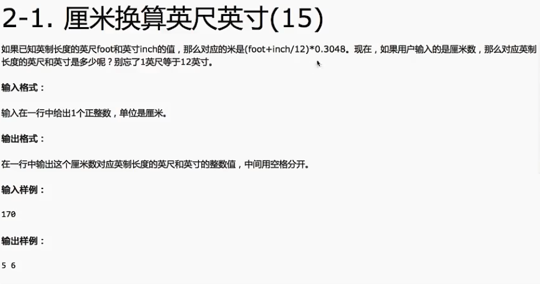
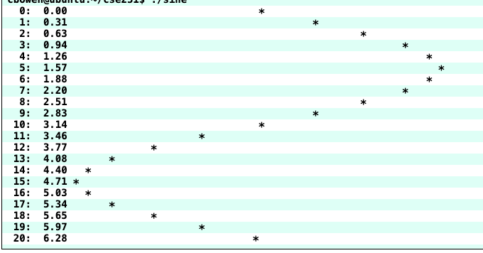
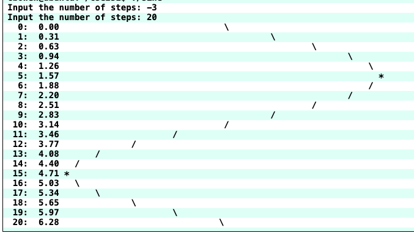

# C语言基础

为了夯实 CS 基本功，于网上找到一份硬核[学习计划](https://www.yuque.com/ob26eq/cv94p5/xi9hwb)，首先学习的是 C 语言先导课程。

**程序**是用特殊的编程语言用来表达如何解决问题的。不是用编程与计算机交谈，而是描述要求其如何做事情的过程和方法。

**程序的执行**

- 解释：借助一个程序，那个程序能理解你的程序，然后按照你的要求执行。
- 编译：借助一个程序，就像一个翻译，把你的程序翻译成计算机真正能懂的语言-机器语言-写的程序，然后这个机器语言写的程序就能执行了

**解释语言 VS 编译语言**

- 语言本无编译/解释之分
- 常用的执行方式而已
- 解释型语言有特殊的计算能力
- 编译型语言有特定的运算性能

## 前置知识（Unix 命令）

```bash
pwd	Displays the current directory
ls	List the current directory	ls
ls -l
ls -a
-l : Include file details, -a : Include hidden files, -F : show directories
touch MyFirstFile setting the time and date of the file to the current time and date, if the file does not exist,it creates an empty one.
rm	Remove a file	rm filetonuke.c rm -i file.c interactive delete file
mkdir	Create a new directory	mkdir cse251
rmdir	Remove a directory	rmdir cse251
Or rm -r if the directory is not empty.
cd	Change current directory	cd ~/cse251
cp	Copy a file	cp souce destination cp ile.c newFile.c  cp ../file.c ~/programs
mv	Move or rename a file	mv hello.c newname.c mv hello.c ../path/
cat	Display the contents of a file	cat hello.c
less	Display file contents nicely	less hello.c
man	Manual pages	man ls
yelp	Nicer help display	yelp &
top	Displays CPU usage	top
q to quit
top display of what processes are using how much CPU and puts the heavies user first
ps	Lists processes	ps u
kill	Kills a process	kill 15577
~: a shortcut for your home directory
gcc hello.c use GNU C Compiler to compile program,and the default output file is a.out
./a.out execute file in the current directory
gcc -o hello hello.c -o indicate the output file is hello instead of a.out
```

## C 语言介绍

在 C 语言头部表明引用的库，如常见的 `<stdio.h>` 表明引入的是标准的输入输出库。

```c
#include <stdio.h>
/*
	上面是必要的格式
	.h 表示头文件，因为这些文件是放在文件的头部
	#include 告诉预处理器将指定的头文件内容插入到预处理器命令的相应位置，导入头文件的预编译指令
	<> 表示系统自带的库
	如果写成 “” 则表明是用户自定义的库，如果没有找到则会去系统自带的库寻找，如果还找不到则报错
*/

/*
 * comment: this is my first program
 */
// main 函数是 C 语言执行的入口 有且只有一个
int main() {
	printf("hello world\n");
  return 0;
}
```


### Escape Characters

- `\n` new line
- `\t` tab
- `\'` print a single quote
- `\\` print a backslash
- many others

### Variable Declarations

- When declare a variable, must tell the compiler what kind of value the variable may hold(its type)
- You cannot change the type of the value a variable can hold once declared
- Everything needs a type in C and it must be declare before use

Syntax: <variable_type> <variable_name> [=<initial_value>]
example: `double width = 10;` `int height;`

```c
#include <stdio.h>
#include <limits.h>

int main() {
  printf("int 储存大小：%lu\n", sizeof(int));
}
```

`printf` 函数输出相关参数，详见[文档](https://www.runoob.com/cprogramming/c-function-printf.html)

```c
#include <stdio.h>
int main() {
  char ch = 'A';
  char str[13] = "www.baidu.com"; 
  float flt = 10.234;
  int no = 143;
  double dbl = 20.123456;
  printf("单个字符串 %c\n", ch);
  printf("字符串 %s\n", str);
  printf("浮点数 %f\n", flt);
  printf("整数 %d\n", no);
  printf("双精度 %lf\n", dbl);
  printf("八进制 %o\n", no);
  return 0;
}
```


```c
#include <stdio.h>
#include <math.h>
int main() {
  printf("%f\n", M_PI); //3.141593
  printf("%.4f\n", M_PI); //3.1416
  printf("%10.2f\n", M_PI); //      3.14
  printf("%-10.2f is PI\n", M_PI); //3.14       is PI
  return 0;
}
```

`%p` 输出变量地址

```c
#include <stdio.h>

int main() {
  float value = 0;
  printf("the value is %p\n", (void*)&value);
  return 0;
}
```

常量定义使用 const 如定义 100，`const int AMOUNT = 100;`，const 表明这个变量值无法修改

`a=b=6;` => `a=(b=6);`

## 输入输出练习题



```c
#include<stdio.h>

int main()
{
  int h = 0;
  printf("请输入身高多少厘米，如167：");
  scanf("%d", &h);
  double temp = h / 0.3048 / 100;
  int foot = temp;
  int inch = (temp - foot) * 12;
  printf("%d %d\n", foot, inch);
  return 0;
}
```


```c
#include <stdio.h>

int main() {
  int startTime = 0;
  int mins = 0;
  printf("please enter two integers: \n");
  scanf("%d %d", &startTime, &mins);
  int h = startTime / 100;
  int min = startTime % 100;
  int totalMins = h * 60 + min + mins;
  int endH = totalMins / 60;
  int endMin = totalMins % 60;
  int endTime = endH * 100 + endMin;
  printf("The end time is %d\n", endTime);
  return 0;
}
```


```c
#include <stdio.h>

int main() {
  int input = 0;
  printf("请输入一个正3位数: \n");
  scanf("%d", &input);
  int output = 0;
  while (input > 0)
  {
    int num = input % 10;
    output = output * 10 + num;
    input = input / 10;
  }
  printf("逆为序数为 %d\n", output);
  return 0;
}
```


```c
#include <stdio.h>

int main() {
  int input = 0;
  printf("请输入一个16进制的数字: \n");
  scanf("%d", &input);
  int output = (input / 16) * 10 + input % 16;
  printf("输出的数为 %d\n", output);
  printf("输出的数为 %x\n", input); // 使用16进制输出
  return 0;
}
```

## 流程控制和布尔值

在 C 语言中没有和 JavaScript 类似的 true 和 false 布尔值，这里使用 0 代表 false，非 0 代表 true。我们也可以引入对应的库来使用 true 和 false, 但是本质还是 1 和 0。

```c
#include <stdio.h>
#include <stdbool.h>

int main() {
  const bool TRUE = true;
  bool falseValue = false;
  int int3 = 3;
  int int8 = 8;
  printf("No 'boolean' output type\n");
  printf("bool trueValue: %d\n", TRUE);
  printf("bool falseValue: %d\n", falseValue);
  printf("int int3: %d\n", int3);
  printf("int int8: %d\n", int8);
  return 0;
}

/**
  No 'boolean' output type
  bool trueValue: 1
  bool falseValue: 0
  int int3: 3
  int int8: 8
*/
```

if 语句与其他语言类似。有时候我们需要种植程序如果输入了一个无效的数据，这时候我们可以使用 **exit** 函数，`exit(0)` 表示程序终止成功，`exit(1)` 表示程序退出时出现错误。

```c
#include <stdio.h>
#include <stdlib.h>
int main() {
  int num = 0;
  printf("please enter a number: ");
  scanf("%d", &num);
  if (num < 0) {
    printf("You moron, you entered a negative inductance!\n");
    exit(1);
  }
  else if (num == 0)
  {
    printf("You are really dumb, you entered zero.\n");
  }
  else
  {
    printf("Okay, I guess that's reasonable\n");
    exit(0);
  }
  printf("Output this line when num equals zero\n");
  return 0;
}
```

##  流程控制练习题

Read the instructions carefully before writing your code. Try to figure out what variables, if, and switch statements you need to create. Write a small part at a time and get it working.

i. Create a new file called tax.c. This program will compute the amount of tax owed by a taxpayer based on annual income and amount of tax exemptions.

ii. Prompt the user to enter his/her annual income.

<span style="color: red">If you get a segmentation fault, it is probably because you did not put the & on the variable in your scanf statement: scanf("%lf", &annualIncome);</span>

iii. If the annual income is less than $9350, the amount of tax owed is zero. Output zero and exit the program. You should get this part working before proceeding.

<span style="color: blue">Incremental Development means you write as little code at a time as you can and test it and get it working. Often it is useful to add in printf statements just to ensure a value is what you are expecting, then remove the statement when you are done.</span>

If you see this error:

```
tax.c:13: warning: incompatible implicit declaration of built-in function 'exit'
```

You forgot to #include <stdlib.h>

iv. Prompt the user to specify filing status, either as: (1) single, (2) married, filing jointly, or (3) married, filing separately

If the user chooses option (1) or option (3), set the number of dependents at 1 and the standard deduction to 5700.
If the user chooses option (2), set the standard deduction to 11400 and prompt the user to enter the number of children. In this case, set the number of dependents to 2 + number of children. Hint: Use switch-case to implement the selection options.

v. Multiply the number of dependents by 3650 and add the standard deduction to determine the total deductions.

vi. Compute the taxable income as the annual income minus the deductions computed in (v) using the following table:

<p style="display:flex;justify-content: center;font-weight: 700;">2010 Federal Income Tax Table If taxable income is:</p>

| Over     | But Not Over | The Tax Is       | Of The Amount Over |
| -------- | ------------ | ---------------- | ------------------ |
| $0       | $16,750      | $0 + 10%         | $0                 |
| $16,750  | $68,000      | $1,675 + 15%     | $16,750            |
| $68,000  | $137,300     | $9,362.50 + 25%  | $68,000            |
| $137,300 | **And Over** | $26,687.50 + 28% | $137,300           |

vii. Display the amount of taxes owed on the screen.

This is a reduced tax table to shorten the project and in the real world there is a different tax table for each filing status. But, you get the idea, right?

As an example, suppose we have married with 3 children making $75000 per year. The annual income is 75000. The number of dependents is 2 + 3 = 5. The standard deduction is 11400. Hence, the total deductions are 11400 + 5 * 3650 = 29650. The taxable income is 75000-29650 = 45350. In the table we see that this amount is over 16750, but not over 68000, so the tax is 1675 + 15% * (45350 - 16750) = 5965. The program should output 5965.

Some other example outputs:


```c
#include <stdio.h>
#include <stdlib.h>
int main() {
  int income = 0;
  int filingStatus = 0;
  int children = 0;
  float tax = 0;
  int deduction = 0;
  int dependents = 0;
  printf("Enter your annual income:");
  scanf("%d", &income);
  if (income < 9350) {
    printf("%.0f\n", tax);
    exit(0);
  }
  printf("What is your filing status?\n");
  printf("1) single\n");
  printf("2) married filing jointly\n");
  printf("3) married filing separately\n");
  printf("please enter a number:");
  scanf("%d", &filingStatus);
  switch (filingStatus)
  {
  case 1:
    deduction = 5700;
    dependents = 1;
    break;
  case 2:
    deduction = 11400;
    dependents = 2;
    break;
  case 3:
    deduction = 5700;
    dependents = 1;
    break;
  default:
    printf("Please enter the correct number, 1、2 or 3.");
    exit(1);
    break;
  }
  if (filingStatus == 2) {
    printf("How much children do you have?");
    scanf("%d", &children);
    if (children < 0) {
      printf("Please enter the correct number of children");
      exit(1);
    }
    dependents += children;
  }
  int totalDeductions = deduction + dependents * 3650;
  int taxableIncome = income - totalDeductions;
  if (taxableIncome <= 16750)
  {
    tax = 0.1 * taxableIncome;
  }
  else if (taxableIncome <= 68000)
  {
    tax = 1675 + (taxableIncome - 16750) * 0.15;
  }
  else if (taxableIncome <= 137300)
  {
    tax = 9362.50 + (taxableIncome - 68000) * 0.25;
  }
  else
  {
    tax = 26687.50 + (taxableIncome - 137300) * 0.28;
  }
  printf("%.2f\n", tax);
  return 0;
}
```

## 循环相关习题

循环 for、while、do while 其语法与 JavaScript 类似。

输出 sin 函数曲线：

```c
#include <stdio.h>
#include <math.h>

int main() {
  double angle;
  int numSteps = 20;
  double maxAngle = M_PI * 2;
  int i = 0;
  double sinValue;
  int numSpaces;
  for (i = 0; i <= numSteps; i++)
  {
    angle = (double)i / numSteps * maxAngle;
    sinValue = sin(angle);
    numSpaces = ceil(30 + sinValue * 30);
    printf("%3d: %5.2f %*c\n", i, angle, numSpaces, '*');
  }

  return 0;
}
```



修改上面代码使其具有以下功能：

a) 获取用户输入 step 数，如果输入的数值小于 2，则再次获取用户输入数值，通过 do/while 实现该循环。

b) 通过用户输入的数值来绘画 sin 函数曲线

c) 不在使用 * 进行绘制，如果波形下降使用 /，如果波形上升使用 \，如果绝对值小于 0.1 则使用 *，输出的波形如下所示



```c
#include <stdio.h>
#include <math.h>
#include <stdbool.h>


int main() {
  int numSteps = 0;
  do
  {
    printf("Input the number of steps: ");
    scanf("%d", &numSteps);
  } while (numSteps < 2);
  double angle;
  double maxAngle = M_PI * 2;
  int i = 0;
  double sinValue;
  int numSpaces;
  bool isRising = true;
  char wave = '*';
  for (i = 0; i <= numSteps; i++)
  {
    angle = (double)i / numSteps * maxAngle;
    sinValue = sin(angle);
    if (isRising) {
      wave = '\\';
    } else {
      wave = '/';
    }
    if ((int)fabs(sinValue) == 1) {
      wave = '*';
      isRising = !isRising;
    }
    numSpaces = ceil(30 + sinValue * 30);
    printf("%3d: %5.2f %*c\n", i, angle, numSpaces, wave);
  }

  return 0;
}
```

